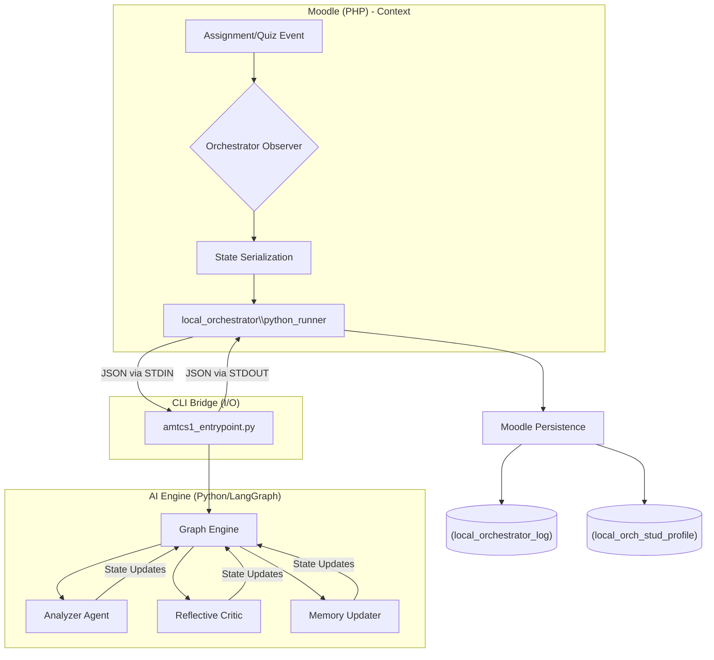

# 🌌 AMT-CS1: Agentic Moodle Terminal Overview

Welcome to the **AMT-CS1 (Agentic Moodle Terminal - Computer Science 1)** master documentation. This system represents a state-of-the-art integration between the Moodle LMS (PHP) and a powerful Multi-Agent AI Orchestration layer (Python/LangGraph).

---

## 🏗️ Core Architecture: The "Agentic Bridge"

The system follows a **Hybrid Orchestration Pattern**. Moodle acts as the **Context Aggregator**, while Python acts as the **Reasoning Engine**.

---

## 🧠 Key Modules

| Module | Purpose | Obsidian Link |
| :--- | :--- | :--- |
| **Orchestrator** | Coordinates multi-agent flows and policy decisions. | [[Agent_Integration_Plan]] |
| **Analyzer** | Performs deep code analysis and logic checking. | [[AI_Diagnosis]] |
| **Critic** | Evaluates generated responses against strict pedagogical policies. | [[AI_Diagnosis#Quality Gate]] |
| **AI Chatbot** | Interactive assistant for hints and guidance. | [[AI_Chatbot]] |
| **Submission Engine** | Context extraction for specific assignment types. | [[Assignments Submission]] |
| **Knowledge Graph** | Tracks student mastery across various Computer Science concepts. | [[KC Graph]] |
| **Multi-modal I/O** | Handles OCR for handwritten code and Video/Audio transcription. | [[OCR]], [[Transcription]] |

---

## 🚦 System Flow: The Submission Lifecycle

1. **Detection**: A student submits a quiz attempt or assignment.
2. **Contextualization**: Moodle retrieves student history, assignment instructions, and relevant grading rubrics.
3. **Reasoning**: The Python Graph evaluates the submission.
4. **Action**: Moodle receives the final payload, logs the interaction, and updates the student's dynamic profile.

---

## 👨‍💻 Detailed Walkthrough: "A Day in the Life of a Submission"

When a student clicks "Submit" on a Java assignment, the following chain reaction occurs:

### 1. The Trigger (Moodle)
Moodle fires an internal event. Our `observer.php` is listening specifically for `assessable_submitted`.
- **Payload**: User ID, Course ID, and links to the submitted Java file.

### 2. The Assembler (PHP)
The `process_orchestrator` method gathers all "Evidence":
- **Student Profile**: Pulls data from `local_orch_stud_profile` (e.g., "Student struggles with loops").
- **Task Context**: Pulls the assignment description ("Write a FOR loop to find primes").
- **Evidence**: Reads the actual code submitted by the student.

### 3. The Handshake (The Bridge)
Moodle calls `python_runner::run_agentic_flow()`. 
- **Under the hood**: It opens a process (`proc_open`) and "talks" to Python.
- **Data Transfer**: It sends a massive JSON packet containing all the collected Evidence.

### 4. The Brain (Python LangGraph)
`amtcs1_entrypoint.py` receives the JSON and starts the engine:
- **Analyzer Agent**: "Views" the code. Checks for syntax and logic.
- **Reflective Critic**: "Wait, the student is a beginner. Don't give them the answer yet. Just give a hint about the semicolon."
- **Memory Updater**: Flags that the student has now attempted "Prime Number Logic".

### 5. The Response (PHP)
Python spits out a final JSON decision. PHP catches it:
- **Logging**: Detailed tracing is saved to `local_orchestrator_log`.
- **Profile Update**: The student's "Learning DNA" is updated in real-time.
- **Delivery**: The teacher or student gets the precisely tuned feedback.

---

## 🛠️ Operational Guide

### 🔐 Environment & API
The system is powered by **Gemini 2.0 Pro** and **GPT-4o-mini**, configured strictly via the root `.env` file.
- `LLM_PROVIDER`: Defaulting to `openai` for production stability.
- `USE_LLM`: Set to `true` to enable active agent reasoning.

### 📜 Logging & Audit
Every single agent interaction is recorded in the `local_orchestrator_log` table.
- **Run ID**: Unique identifier for tracking a single request through the entire graph.
- **Agents Called**: JSON list of which specific agents participated in the decision.

---

> [!TIP]
> **Developer Note**: When adding new agent capabilities, define the state transition in `logic_scratch/state.py` first to ensure the PHP-to-Python bridge remains synchronized.

> [!IMPORTANT]
> **Dynamic Profile**: Student behaviors are tracked across assignments to build a "Learning DNA" in the `local_orch_stud_profile` table.
