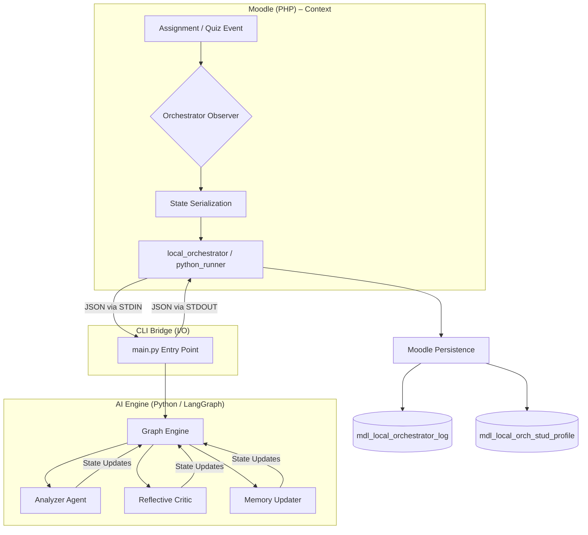

# AMT-CS1 – Project Overview

**AMT-CS1 (Agentic Moodle Terminal – Computer Science 1)** is a state-of-the-art integration between the Moodle LMS (PHP) and a Multi-Agent AI Orchestration layer built with Python and LangGraph. Its goal is to provide an **Agentic Multimodal AI Tutor** that helps students through personalized feedback, interactive practice, and intelligent assistance.

---

## 🏗️ Core Architecture: The "Agentic Bridge"

The system follows a **Hybrid Orchestration Pattern**. Moodle acts as the **Context Aggregator**; Python acts as the **Reasoning Engine**.

---

## 🔄 AFS v2 Pipeline

Every request passes through a structured graph of autonomous agents:

1. **Orchestrator** — Classifies intent (`SUBMISSION`, `PRACTICE`, `CHAT`) and enforces security policies.
2. **Analyzer** — Deep evaluation of student work, delegating to two sub-agents:
   - **Logic Agent** — Algorithmic correctness & reasoning.
   - **Style Agent** — Syntax, formatting & pseudocode standards.
3. **Lesson Generator** — Generates personalized problems and study plans.
4. **Reflective Critic** — Self-correction loop: rejects if content leaks answers or is pedagogically unsound.
5. **Quality Gate** — Final check before feedback reaches the student.

---

## 🛠️ Key Features

| # | Feature | Description |
| :-- | :--- | :--- |
| 1 | **AI Chat Assistant** | Context-aware GPT-4o tutor. Can trigger tool actions like quiz creation. |
| 2 | **Personal Quiz System** | On-demand adaptive practice problems injected directly into Moodle quizzes. |
| 3 | **Dual-Agent Evaluation** | Style + Logic agents grade submissions independently, then combine findings. |
| 4 | **OCR & Transcription** | Vision and audio pipelines convert handwritten/spoken work to text. |
| 5 | **Knowledge Graph** | KC Graph tracks student mastery; identifies prerequisite gaps. |

---

## 📂 Codebase Structure

| Directory | Purpose |
| :--- | :--- |
| `agents/` | Core agent logic (`orchestrator.py`, `analyzer.py`, `lesson_generator.py`). |
| `tools/` | Specialized modules (`quiz_verifier.py`, `response_formatter.py`, `fusion_agent.py`). |
| `logic_scratch/` | Infrastructure layer (`graph_engine.py`, `llm_factory.py`, `moodle_adapter.py`). |
| `public/local/` | PHP AJAX entry points (the "bridge" to Moodle). |
| `admin/cli/` | Python CLI entry points called by Moodle (`chat.py`, `diagnose.py`, `main.py`). |

---

## 🚦 Submission Lifecycle

| Step | Component | Action |
| :-- | :--- | :--- |
| 1 | **Student** | Submits a quiz/assignment. |
| 2 | **Moodle PHP** | `observer.php` catches `assessable_submitted` event. |
| 3 | **PHP Assembler** | Gathers student profile, task context, and submission evidence. |
| 4 | **Bridge** | `python_runner::run_agentic_flow()` opens `proc_open` → sends JSON via STDIN. |
| 5 | **Python Engine** | Orchestrator → Analyzer → Critic → Response Formatter. |
| 6 | **PHP Receiver** | Parses JSON from STDOUT → logs to `mdl_local_orchestrator_log` → updates gradebook. |

---

## 🔑 Operational Modes

| Mode | Trigger | Focus |
| :--- | :--- | :--- |
| **Submission** | Student submits an assignment or quiz. | Scoring, Misconception Detection, Logic Review. |
| **Practice** | Student requests practice via AI Chat. | Personal Problem Generation, Socratic Questioning. |
| **Study Planner** | Explicit request. | KC-based roadmap generation. |

---

## ⚙️ Environment & Configuration

- **Primary Models**: `gpt-4o-mini` (production), `gemini-2.5-flash` (multimodal).
- **Config File**: `.env` at the project root — `LLM_PROVIDER`, `OPENAI_API_KEY`, `USE_LLM`.
- **Logging**: All agent interactions recorded in `mdl_local_orchestrator_log` (run ID, agents called, policy decision).

> [!TIP]
> When adding new agent capabilities, define the state transition in `logic_scratch/state.py` **first** to keep the PHP↔Python bridge synchronized.

> [!IMPORTANT]
> Student behaviors are tracked across assignments to build a "Learning DNA" profile in `mdl_local_orch_stud_profile`.

---

## 🌍 Language Support

Fully bilingual — **Indonesian** and **English**. The AI auto-detects the student's language for both the Chat Assistant and quiz generation.

---
**Tags**: #architecture #afs-v2 #moodle #agentic-ai #overview
