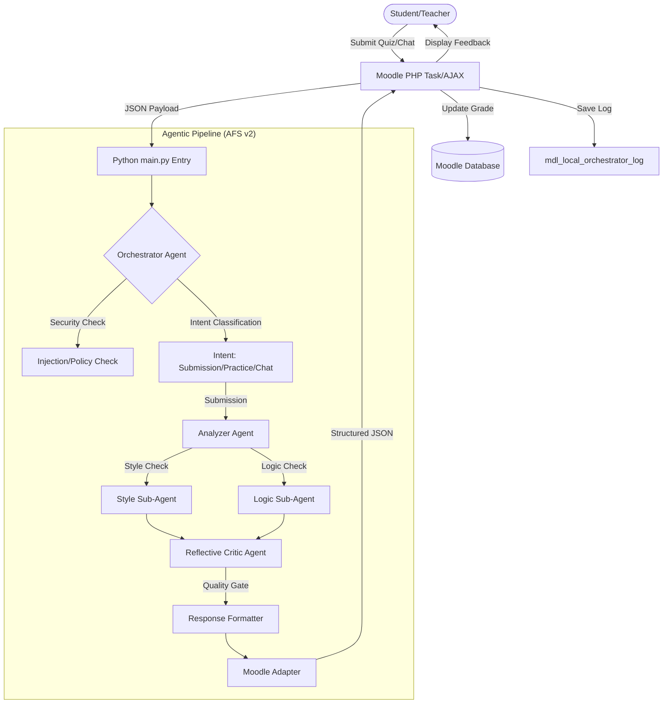

# System Overview: AMT-CS1 Agentic Orchestration

This document provides a high-level overview of the **AFS v2 (Automated Feedback System v2)** architecture and the end-to-end user flow within the Moodle LMS.

## 🏗️ System Architecture

The system follows a **Graph-based Agentic Pipeline** where a central **Orchestrator** manages the lifecycle of a request, ensuring security, classifying intent, and routing to specialized agents.

---

## 🚀 End-to-End User Flow (Quiz Diagnosis)

1. **Submission**: A student submits a pseudo-code answer to a Moodle essay question.
2. **Event Trigger**: Moodle's `attempt_submitted` event triggers an ad-hoc task: `diagnose_quiz_attempt_task`.
3. **Context Assembly**: The PHP task gathers everything the AI needs:
   - Student's text/media.
   - Question text & Max mark.
   - Student's preferred language.
4. **Python Handover**: PHP executes `python main.py --stdin` and pipes a JSON payload.
5. **Orchestration**:
   - The **Orchestrator** checks for jailbreaks or prompt injections.
   - It determines that this is a `SUBMISSION` intent.
6. **Analysis**:
   - **Style Sub-Agent** checks pseudo-code syntax (e.g., `program`, `endprogram`, `algorithm`).
   - **Logic Sub-Agent** evaluates the solution's logic against the question requirements and calculates a score.
7. **Criticism**: The **Critic** ensures the feedback is constructive, consistent, and doesn't "leak" the full solution too early (CFF principles).
8. **Logging**: The full pipeline trace (nodes executed, intent, CFF state) is returned to PHP and saved in `mdl_local_orchestrator_log` for administrative transparency.
9. **Final Result**: The Moodle gradebook is updated with the mark, and the student sees a detailed, multi-layered feedback diagnosis.

---

## 🧠 Key Features Integrated

### 🛡️ Security Gate (Orchestrator)
Prevents students from using "system prompt" or "ignore instructions" tricks to cheat the grading logic.

### 🧘 Cognitive Forcing Functions (CFF)
Implemented in the `Orchestrator` to reduce over-reliance. It can hide AI suggestions until the student has made a genuine attempt or explicitly requested help.

### 📊 Transparent Traceability
Every execution is logged. Teachers can go to the **Orchestrator Report** in Moodle to see exactly which agents were called and what routing decisions the AI made.

### 🎨 Personalized Learning
The **Learning Style Adapter** node adjusts the feedback tone and resource recommendations based on the student's detected mastery level and preferences.

---
**Tags**: #architecture #agentic-ai #moodle #orchestrator #user-flow
