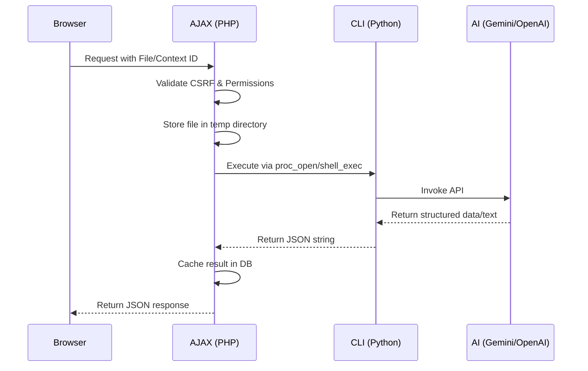

# AI Integration Overview

This document describes the general architecture and shared requirements for the AI-powered features (Transcription, OCR, AI Diagnosis, and AI Chatbot) integrated into this Moodle environment.

## 🏗️ Hybrid Architecture

The system uses a **Mixed-Language Architecture** to leverage the strengths of different ecosystems:

- **PHP (Gateway Layer)**: Located in `public/local/`, these scripts handle Moodle-specific tasks like user authentication (`require_login`), session validation (`require_sesskey`), file retrieval from the Moodle database, and JSON response delivery.
- **Python (AI Engine Layer)**: Located in `admin/cli/`, these scripts contain the core AI logic. They interface with external LLMs (Gemini, OpenAI, Azure) using libraries like LangChain and Pydantic.

### Typical Data Flow

---

## 🔑 Operational Requirements

### Environment Configuration (`.env`)
All API keys must be defined in the `.env` file located in the project root. The Python engines read this file automatically.

> [!IMPORTANT]
> Ensure the following keys are set:
> - `GEMINI_API`: Primary key for Gemini 2.x models.
> - `OPENAI_API`: Key for OpenAI Whisper and GPT-4o models.
> - `AZURESPEECH_API`: Key for Azure Speech-to-Text.
> - `AZURE_REGION`: Region for Azure services (e.g., `eastus`).

### Caching
To minimize API costs and improve performance, results are often cached in Moodle database tables:
- `local_transcribe_results`: Transcription cache.
- `local_ocr_results`: OCR cache.
- `$_SESSION`: Conversation history for the AI Chatbot.

---

## 📂 Directory Structure

| File Location | Purpose |
| :--- | :--- |
| `public/local/` | AJAX entry points for web requests. |
| `admin/cli/` | Command-line scripts for batch/background processing. |
| `local/orchestrator/` | Shared logic for evaluation and events (Quality Gate). |
| `public/course/format/templates/local/` | Mustache templates for AI-enhanced UI components (e.g., Chatbot). |
